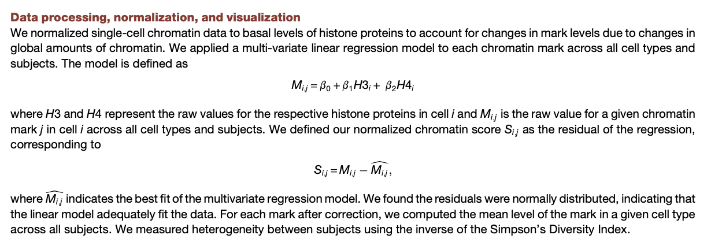

# CytofkitNormalization.R

A simple R6 package which
 
  - reads the standard results file produced by cytofkit
  - adds new columns to the matrix contained therein, normalizing
    marker values against H3 and/or H4 "total" histone values.
    
## Reference

From Alex Kuo's group, this paper applies linear regression
normalization to cytof data.

Cheung, Peggie, et al. "Single-cell chromatin modification profiling reveals increased 
epigenetic variations with aging." Cell 173.6 (2018): 1385-1397. 
DOI: [https://doi.org/10.1016/j.cell.2018.03.079](https://doi.org/10.1016/j.cell.2018.03.079)

The relevant section:

This paper, cited by  may be the first to apply regression normalization to
cytometry data.
Knijnenburg, T.A., Roda, O., Wan, Y., Nolan, G.P., Aitchison, J.D. and
Shmulevich, I., 2011. A regression model approach to enable cell
morphology correction in high‐throughput flow cytometry. Molecular
systems biology, 7(1), p.531. https://www.embopress.org/doi/pdf/10.1038/msb.2011.64

