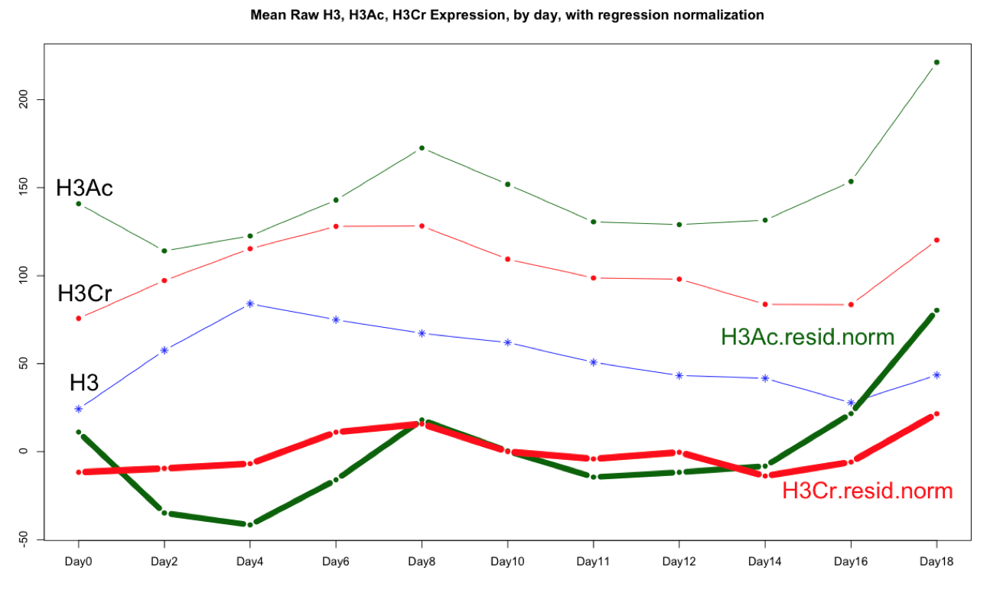

# CytofkitNormalization

An R6 package which
 
  - reads the standard results file produced by cytofkit
  - adds new columns to the matrix contained therein, normalizing
    marker values against H3 and/or H4 "total" histone values.
  - provides several convenience functions for publication-quality graphics
    
## References

Our normalization strategy is inspired by work Alex Kuo's group,
described in  this 2018 paper, which applies linear regression
normalization to cytof data:

Cheung, Peggie, et al. <i>Single-cell chromatin modification profiling reveals increased 
epigenetic variations with aging</i>. Cell 173.6 (2018): 1385-1397. 
 
DOI: [https://doi.org/10.1016/j.cell.2018.03.079](https://doi.org/10.1016/j.cell.2018.03.079)

The relevant section of this paper describing their normalization
method, which we re-implement in the
<b>normalizeMarker</b> method of the <b>CytofkitNormalization</b> class:

This 2011 paper, cited by Cheung,  may be the first to describe the use of regression normalization to
(flow) cytometry data:

Knijnenburg, T.A., Roda, O., Wan, Y., Nolan, G.P., Aitchison, J.D. and
Shmulevich, I., 2011. <i>A regression model approach to enable cell
morphology correction in high‐throughput flow cytometry</i>. Molecular
systems biology, 7(1), p.531.
 
https://www.embopress.org/doi/pdf/10.1038/msb.2011.64

